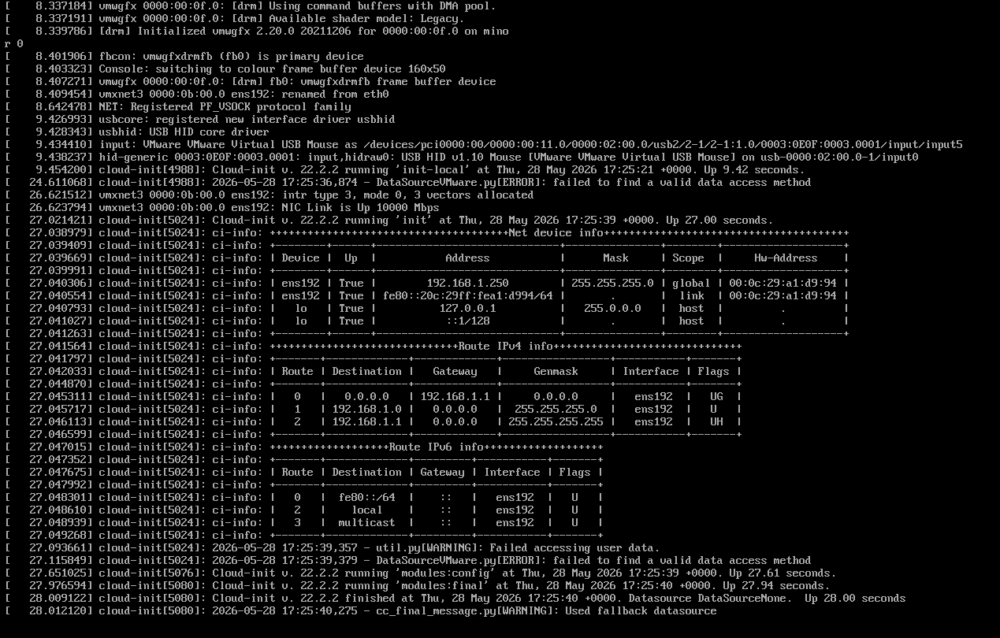

**Clear DNF cache**:
`sudo dnf clean all`

**Disable the built-in PostgreSQL module**:
`sudo dnf -qy module disable postgresql`

**Try the installation again**:
`sudo dnf install -y postgresql17-server` [[1](https://stackoverflow.com/questions/66771641/cant-install-package-from-file-last-metadata-expiration-check-error-unable-t), [2](https://computingforgeeks.com/install-postgresql-17-on-rocky-almalinux-centos/), [3](https://www.youtube.com/watch?v=IXQhviqT_8I), [4](https://www.reddit.com/r/PostgreSQL/comments/15mhb66/unable_to_install_postgres_on_linux_8_oracle/), [5](https://www.youtube.com/watch?v=VMn8IqvRENA)]


Step-by-Step Installation for CentOS

If the issue persists, follow this clean installation path using the PostgreSQL official repository to ensure you are getting the correct RPMs: [[1](https://www.youtube.com/watch?v=IXQhviqT_8I), [2](https://www.youtube.com/watch?v=yX1eYrozE84)]

1. **Install the Repository RPM**:
   Select the version for your CentOS version (e.g., EL9):
   `sudo dnf install -y https://download.postgresql.org/pub/repos/yum/reporpms/EL-9-x86_64/pgdg-redhat-repo-latest.noarch.rpm`

2. **Disable Default Modules**:
   `sudo dnf -qy module disable postgresql`

3. **Install PostgreSQL 17**:
   `sudo dnf install -y postgresql17-server`

4. **Initialize the Database**:
   `sudo /usr/pgsql-17/bin/postgresql-17-setup initdb`

   sudo /usr/bin/postgresql-setup --initdb --unit postgresql

5. **Start and Enable the Service**:
   `sudo systemctl enable postgresql-17`
   `sudo systemctl start postgresql-17` [[1](https://www.reddit.com/r/PostgreSQL/comments/15mhb66/unable_to_install_postgres_on_linux_8_oracle/), [2](https://computingforgeeks.com/install-postgresql-17-on-rocky-almalinux-centos/), [4](https://www.if-not-true-then-false.com/2012/install-postgresql-on-fedora-centos-red-hat-rhel/), [5](https://www.youtube.com/watch?v=VMn8IqvRENA), [6](https://www.youtube.com/watch?v=o0ByIXHaIbw), [7](https://www.youtube.com/watch?v=IXQhviqT_8I)]

6. 

## Initial Database and Start service

```bash
# service postgresql initdb
# systemctl enable postgresql
# systemctl start postgresql
```




1. Set Password for the PostgreSQL Database User

This password is used for connecting to the database over a network or when using tools like pgAdmin. [[1](https://www.linode.com/docs/guides/how-to-install-postgresql-relational-databases-on-centos-7/), [2](https://www.sqlshack.com/learn-postgresql-install-postgresql-on-centos-linux/), [3](https://help.ubuntu.com/community/PostgreSQL)]

- **Switch to the postgres Linux user:**

  bash

  ```
  sudo -i -u postgres
  ```

  Use code with caution.

- **Access the PostgreSQL prompt:**

  bash

  ```
  psql
  ```

  Use code with caution.

- **Update the password:**
  Run the following SQL command within the prompt (replace `your_new_password` with a strong one):

  sql

  ```
  ALTER USER postgres WITH PASSWORD 'G00dC@de5';
  ```

Configure PostgreSQL for Remote Access [[1](https://ploi.io/documentation/database/how-to-allow-remote-access-to-postgresql)]

Even with the AWS firewall open, PostgreSQL's internal settings must be adjusted to listen for connections. [[1](https://devopscube.com/install-configure-postgresql-amazon-linux/), [2](https://aws.amazon.com/marketplace/pp/prodview-h27ltcbjj5lyy)]

- **listen_addresses**: Edit `/var/lib/pgsql/data/postgresql.conf` and set `listen_addresses = '*'` to listen on all interfaces.

- **pg_hba.conf**: Edit `/var/lib/pgsql/data/pg_hba.conf` to allow specific remote users or IP ranges. Add a line like:

  text

  ```
  host    all             all             0.0.0.0/0            scram-sha-256
  ```

  

  *(Replace `0.0.0.0/0` with your specific subnet for better security)*.