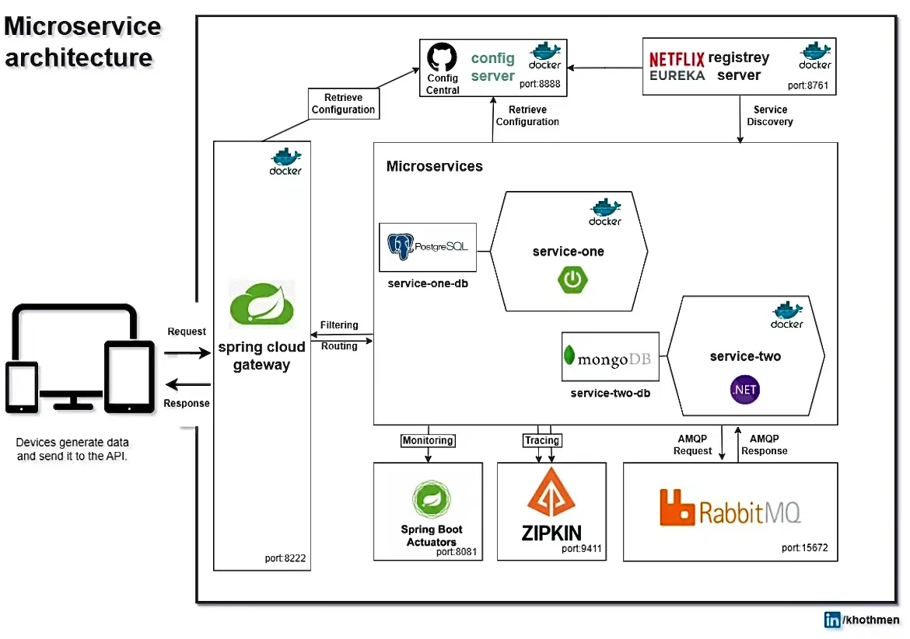

如何2个月自学工业级后端项目

第5️⃣个星期：

SpringBoot1️⃣ 

SpringBoot做了什么（1天） 

Spring Security（2天） 

GlobalExceptionHandler (17) 

SpringData JPA（1天） 

MySQL（1天） 

Postman （1天）  

第6️⃣个星期：

SpringBoot2️⃣ 

Spring Validator （1天） 

RestTemplate（1天） 

Swagger（1天） 

Spring Async（1天）

JUnit Mockito JaCoCo（1天） 

Spring Cache + Redis（1天）

  

第7️⃣个星期：

SpringCloud 微服务架构（1天） 

API Gateway（1天） 

Netflix Eureka (1天) 

Spring Cloud Config (1天) 

OpenFeign（1天） 

Resilience4j / Hystrix (1天)  

第8️⃣个星期：

SpringCloud Message Queue: Kafka/RabbitMQ (2天) 

Docker （1天） 

Prometheus + Grafana (1天) 

Sleuth/Micrometer + zipkin (1天) 

AWS S3 +RDS + DynamoDB (1天) 

MongoDB（1天）

